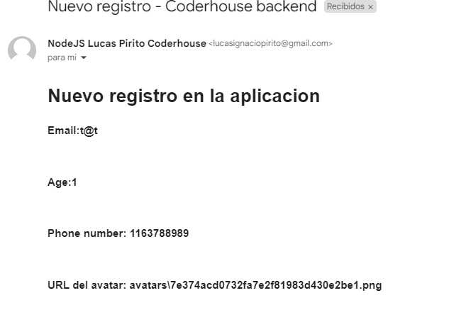

# Coderhouse | Back-end

Proyecto back-end realizado por Lucas Pirito en Coderhouse.

# Levantar en local

El servidor se puede levantar o stoppear de las siguientes maneras:

### Utilizando Forever

- `npm run forever`
  Inicia el servidor con forever en modo cluster
- `npm run foreverStop`
  Stoppea todas las instancias forever del servidor.

### Utilizando PM2

- `npm run pm2Fork`
  Inicia el servidor con PM2 en modo fork junto a 2 instancias en los puertos 8080 y 8081 dandole mas peso al 8080

- `npm run pm2Cluster`
  Inicia el servidor con PM2 en modo cluster a partir del puerto 8080

- `npm run pm2Stop`
  Stoppea todas las instancias PM2 activas

# Glitch

El proyecto se hosteara en glitch.com debido a que Heroku dejara de ser gratis a partir del 28 de Noviembre de 2022.

## Glitch TextEncoder error / dependency error

Me tope con un error donde Glitch tiene problemas con una dependencia que utiliza Textencoder. Hay que agregar la siguiente linea al `package.json`:

```json
  "engines": { "node": "12.x" },
```

Esto soluciono el problema ya que Glitch viene con node 6 por default, el cual genera conflictos con algunas dependencias.

_Esto es algo que voy a averiguar mas adelante ya que no hay una explicacion muy clara del problema 👻_

# API Routes

Documentacion con respecto a las rutas disponibles de la aplicacion

## Carrito
|Ruta         |POST                 |GET|DELETE
|-------------|---------------------|---|----|
|/api/carrito/|Crea un nuevo carrito|Obtiene todos los carritos| 
|/api/carrito/:idCarrito/productos/:idProducto| Agrega al carrito seleccionado un producto utilizando id's de `Mongo`| ❌| Elimina un producto segun su id dentro de un carrito 
|/api/carrito/:idCarrito|❌| Obtiene todos los productos en un carrito especifico| Elimina un carrito especifico
## Productos

# Nodemailer

Dejo en evidencia el funcionamiento del envio de mail cuando se registra un nuevo usuario ya que es una consigna de la entrega:


